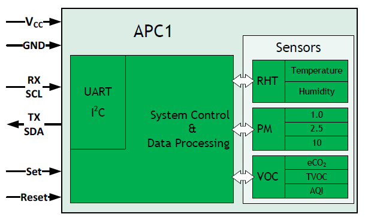
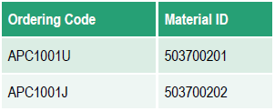

# Sciosense APC1
Basic routines for driving Sciosense APC1 on UART and I2C 
   
The examples contain 
- simple reading via UART
- simple reading via I²C (optional sleep mode)
- providing data to be stored in Prometheus (see details [here](https://github.com/highonvoltageen/Sciosense-APC1-ESP32/tree/main))
   
    
  
Find more details on [ScioSense Website](https://www.sciosense.com) and under the [product description](https://www.sciosense.com/apc1-air-quality-combo-sensor/)
 
:warning:  APC1 comes in two flavours: with UART or with I²C, those are two different order codes 
    

