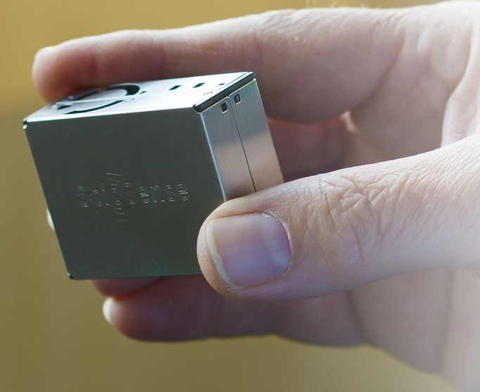

# Sciosense APC1
Basic routines for driving Sciosense APC1 on UART and I2C 
The examples contain 
- simple reading via UART
- providing data to be stored in Prometheus (see details [here](https://github.com/highonvoltageen/Sciosense-APC1-ESP32/tree/main))
   
  
Find more details on [ScioSense Website](https://www.sciosense.com) and under the [product description](https://www.sciosense.com/apc1-air-quality-combo-sensor/)

